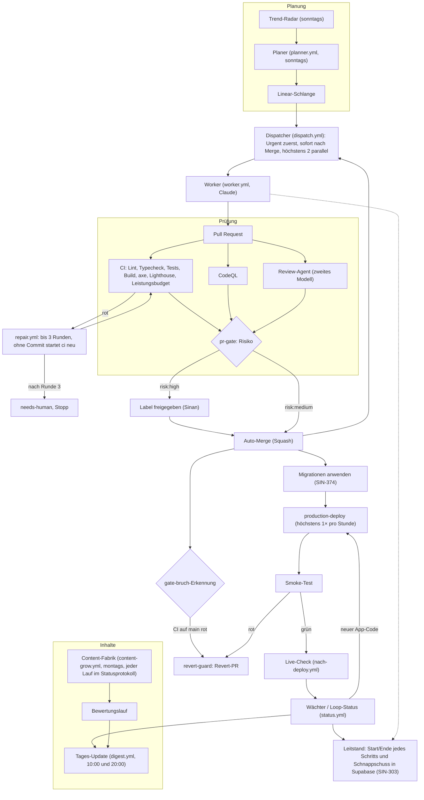

# Content-Agent-Lernapp

Lern-App, die aus einem Schlagwort (Pilot: Maschinen- und Anlagenführer) einen Kurs aus amtlichen Quellen erzeugt und aktuell hält.

## Stack (current)

| Layer | Choice |
| --- | --- |
| App | Next.js 16 + React 19 + TypeScript + Tailwind 4 |
| Hosting | Vercel |
| Persistence | Supabase EU (AP-17) with in-memory mock fallback |
| Quality / tracing | Langfuse Cloud EU — JS/TS SDK v5 / platform v4 OTEL ([SIN-197](https://linear.app/sinan-kahraman/issue/SIN-197)) |
| Ops scaffold | Hermes weekly source check + Telegram (AP-10/AP-16) |
| Models | Claude for generate (Batch); OpenAI mini as judge (D-06/D-07) |

## Docs

- [`docs/PRODUCT.md`](docs/PRODUCT.md) — Konzept und Bauplan AP-00–AP-12
- [`docs/DECISIONS.md`](docs/DECISIONS.md) — Architekturentscheidungen mit Links
- [`docs/ARCHITECTURE.md`](docs/ARCHITECTURE.md) — Runtime- und API-Überblick
- [`AGENTS.md`](AGENTS.md) — Entscheidungs- und Stopp-Regeln
- [`docs/LANDKARTE.md`](docs/LANDKARTE.md) — Repo-Landkarte: wo liegt was, Befehle, Konventionen (SIN-320)
- [`docs/autonomy/groessen.md`](docs/autonomy/groessen.md) — Größen der Issues, Modell und Runden je Größe, Bündeln, Verbrauch (SIN-320)
- [`docs/content/README.md`](docs/content/README.md) — Curriculum-Maps (AP-13): MAF in allen fünf Schwerpunkten und Industriekaufleute 2024
- [`docs/content/DIDAKTIK.md`](docs/content/DIDAKTIK.md) — Didaktik-Vorgabe (AP-18): Schablone je Einheit, Fragestufen, Wiederholung, Prüfungsmodus, Bilder
- [`docs/content/MAF-CURRICULUM.md`](docs/content/MAF-CURRICULUM.md) — Vorgängerversion v1 (nur Metall); runtime loader uses `docs/content/maf-metall.json` via AP-14 ([PR #24](https://github.com/siinanXD/Content-Agent-Lernapp/pull/24))

## Local development

```bash
npm install
npm run dev
```

Dev server: [http://127.0.0.1:43123](http://127.0.0.1:43123) (`npm run dev` → port 43123).

### Learner UI (AP-08 + AP-18 Didaktik)

Playable path (Figma approved by Sinan 2026-10-02; Didaktik D-31):

0. `/` Startseite für Bildungsträger (Scroll-Story), `/willkommen` App-Einstieg  
1. `/start` — Schlagwort + Lernvariante → Kurs erzeugen  
2. `/lernpfad` — Module/Blöcke, Wiederholung, Prüfungsmodus  
3. `/einheit/unit-03` — sections + alle 5 Fragetypen (+ Bildfragen)  
4. `/wiederholung` — Leitner 1/3/7/14  
5. `/pruefung` — schriftliche Teile aus `exam.gradedParts` (MAF PT/PP/WiSo)  
6. `/ergebnis` — Punkte + Ampel je Gebiet  
7. `/profil` — Fortschritt, Stapelgröße, Prüfungsreife

Beispielmodus ohne Konto (SIN-408): `/lernpfad?demo=1` schaltet für die Browser-Sitzung erfundene Beispieldaten ein (Ergebnis, Wiederholung, Profil, Serie). Es wird nichts gespeichert oder gesendet; `?demo=0` beendet ihn. `/quellen` zeigt die Quelle je Einheit mit Abrufdatum. Gruppenansicht: `/ausbilder?demo=1` (SIN-385).  

Design source: [Figma](https://www.figma.com/design/0SWGDO2ioBD3MyXiAnrbRz) · tokens in `docs/design/`. Phase-A SVGs: `npm run content:mermaid`.

```bash
npm test
npm run content:mermaid
npm run test:a11y
npm run test:lighthouse   # app must be running on :43123 (or add -- --serve)
npm run hermes:dry-run    # AP-10 scaffold (no live Telegram)
npm run pilot:maf         # AP-11 seed/fixture pipeline (app on :43123)
npm run supabase:verify   # when SUPABASE_* present
npm run build
npm run lint
```

A11y gates (axe über alle Routen, Tastatur, Lighthouse a11y ≥ 0.9) laufen im CI-Job `build` (`.github/workflows/ci.yml`) und dürfen nicht abgeschaltet werden.

## Pipeline-Ablauf (SIN-376)

Quelle: [`docs/diagramme/pipeline.mmd`](docs/diagramme/pipeline.mmd), Nutzerwege: [`docs/diagramme/nutzerwege.mmd`](docs/diagramme/nutzerwege.mmd). Der Block unten ist eine Kopie von `pipeline.mmd` (ein Test prüft das). FigJam wird in einer Claude-Sitzung aus den `.mmd` nachgezogen, das Tages-Update meldet „Diagramme geändert“.



## Qualität und Pflege (SIN-300)

| Was | Befehl / Workflow | Wirkung |
| --- | --- | --- |
| Leistungsbudget | `npm run build && npm run perf:budget -- --serve` · Grenzen in `performance-budget.json` | LCP (höchstens 2,5 s), CLS, TBT und JS-Größe je Route (Handy, Median aus 5 Läufen; `--details` zeigt das LCP-Element). Überschreitung macht `build` rot und blockiert den Merge. |
| Bildvergleich | `npm run visual -- --update-snapshots`, danach `npm run visual` · Workflow `visual.yml` | Handy- und Desktop-Bilder aller Seiten gegen main. Nur Hinweis (Lauf-Bericht, Artefakt `bildvergleich`), kein Gate; die Referenz kommt immer frisch aus main. |
| Aufräum-Agent | `npm run cleanup:scan` · Workflow `aufraeumen.yml` (montags) | Ungenutzte Dateien, tote Pakete, große Dateien, Doppelungen, Doku-Abgleich: ein PR pro Woche. |
| Trend-Radar | Workflow `trend-radar.yml` (sonntags) · `node scripts/autonomy/trend-radar.mjs --week` | Claude recherchiert Trends (GitHub, Figma Riffs/Weave, Hugging Face, Changelogs, Skills/MCP), schreibt `docs/research/trend-radar-<JJJJ-KW>.md` (ein PR pro Woche) und legt pro Lauf genau ein Linear-Issue „Trend-Radar KW <JJJJ-KW>“ (Label `research`, alle Funde als Checkliste) an; bei `dry_run` entsteht nichts in Linear. Nichts wird automatisch eingebaut. Der Tages-Update nennt den Bericht montags. Entscheidung: [`SIN-313`](docs/decisions/SIN-313-trend-radar.md). |
| README-Erinnerung | `npm run readme:check` · Schritt im CI-Job `build` | Warnung, wenn ein PR Befehle, Seiten, Umgebungsvariablen oder Workflows ändert, ohne `README.md` anzufassen. |
| Changelog | `npm run changelog` (braucht volle Git-Historie) | [`CHANGELOG.md`](CHANGELOG.md) aus den Conventional-Commit-Titeln auf main, ohne KI. Erzeugt, nicht von Hand bearbeiten; der Aufräum-Lauf aktualisiert sie. |
| CodeQL | Workflow `codeql.yml` (PR, main, montags) · `node scripts/autonomy/codeql-gate.mjs <Ordner>` | JavaScript/TypeScript. Funde ab `security-severity` 7.0 machen den Lauf rot (SARIF als Artefakt `codeql-sarif`). |
| Paket-Updates | `.github/dependabot.yml` (Dependabot, montags) | npm und Actions: Minor/Patch als Bündel, Major einzeln. Sicherheits-Updates sofort (Repo-Einstellung). Entscheidung: [`SIN-295`](docs/decisions/SIN-295-codeql-updates.md). |
| Review-Agent | Workflow `review.yml` · `node scripts/autonomy/review.mjs --pr <Nr>` · Secret `OPENAI_API_KEY`, Repo-Variable `REVIEW_DAILY_CAP_USD` (Standard 2) | Ein OpenAI-Modell liest jeden PR-Diff gegen den Auftrag und kommentiert mit Schwere. Schwer: Claude repariert im selben PR (zählt als Runde), leicht: nur Hinweis. Behauptet ein Fund rote Tests oder einen kaputten Build, obwohl `build` grün ist, gilt er als widerlegt; von der Reparatur begründet verworfene Funde („Fund geprüft, keine Änderung nötig“) zählen nicht als Runde und kommen nicht erneut als schwer (SIN-381). Kosten je Review im Kommentar, Tagesdeckel, Label `no-review` überspringt. Entscheidung: [`SIN-297`](docs/decisions/SIN-297-review-agent.md). |
| Recht-und-Inhalt-Wächter | `src/lib/review/` · läuft in `POST /api/courses/{id}/publish` | Blockiert die Veröffentlichung (422, `reason: content_guard`) bei fehlender Quelle oder Abrufdatum, fehlender KI-Kennzeichnung, Personendaten oder IHK-Aufgaben als Vorlage. Die Verbote aus `AGENTS.md` stehen als Liste in `regeln.ts`. |
| Leitstand-Ereignisse | `node scripts/autonomy/leitstand.mjs ereignis --schritt <dispatch\|worker\|pr-gate\|planner\|digest\|status> --status <start\|ok\|fehler>` · braucht `SUPABASE_URL`, `SUPABASE_SERVICE_ROLE_KEY` (vorhandene Secrets) | Jeder Schritt schreibt Start und Ende in Supabase `loop_events` (Projekt, Schritt, Issue, PR, Status, Dauer; der Worker zusätzlich Tokens und `total_cost_usd`), `status.yml` den Stand in `loop_snapshot` (Kontingente, Schlange, offene PRs). Lesen nur für Nutzer in `leitstand_nutzer` (RLS), keine Personendaten. Ohne Secrets nur eine Warnung. Für alle Repos gleich (`LEITSTAND_PROJEKT` überschreibt den Projektnamen). Entscheidung: [`SIN-303`](docs/decisions/SIN-303-leitstand-ereignisse.md). |
| Aufgaben für Sinan | `node scripts/autonomy/sinan.mjs sync\|list\|create` (braucht `LINEAR_API_KEY`) | Was nur Sinan tun kann, steht als Linear-Issue mit Label `sinan` (Link, Minuten, Schritte, Prüfung), nicht im PR-Text. Tages-Update und Status-Seite zeigen sie unter „Braucht dich“; der Loop schließt sie selbst, wo er es lesen kann. Entscheidung: [`SIN-310`](docs/decisions/SIN-310-sinan-issues.md). |
| Projekt-Starter (nur Plan) | `node scripts/autonomy/starter.mjs plan --name N --idee I [--supabase geteilt\|eigen\|aus] [--ohne posthog,langfuse] [--json]` · `starter.mjs sql --schema S` | Baut aus Name und Idee den Plan für ein neues Projekt (Schritte je Dienst, benötigte Konto-Tokens nur als Namen, Prüfung je Schritt, Start-Issues). Führt nichts aus; `--live` ist gesperrt, bis die Konto-Tokens in Infisical liegen und der Loop eine Woche stabil lief. Entscheidung: [`SIN-202`](docs/decisions/SIN-202-projekt-starter.md). |

Ops / pilot docs: [`docs/ops/HERMES.md`](docs/ops/HERMES.md) · [`docs/pilot/MAF-PILOT.md`](docs/pilot/MAF-PILOT.md) · [`docs/learning/LOOP.md`](docs/learning/LOOP.md) · [`docs/ops/SUPABASE.md`](docs/ops/SUPABASE.md).

## Phase A (AP-15)

First live course slice after the curriculum map: modules `M0`, `LF1`, `LF2`, `PA` (~280 units), generate with Claude Batch, judge with OpenAI mini, publish only through the quality gate. Tracked in [SIN-193](https://linear.app/sinan-kahraman/issue/SIN-193). Costs and scores should land in Langfuse Cloud EU — prefer completing the v4 cutover ([SIN-197](https://linear.app/sinan-kahraman/issue/SIN-197)) before relying on dashboards for that run.

```bash
npm run ap15:phase-a:dry
npm run ap15:phase-a
```

Artifacts land in `docs/ops/AP15-PHASE-A.md` and `docs/ops/ap15-runs/`.

## Deploy

Vercel project pointed at this repo. Empty/scaffold build must succeed (AP-01).

Git deploys are off (`git.deploymentEnabled: false` in `vercel.json`, SIN-309): neither `main` nor PR branches create Vercel deployments, so nothing counts against the Hobby limit of 100/day. Production is deployed by the `production-deploy` workflow (`vercel deploy --prod` via CLI, SIN-332; needs secret `VERCEL_TOKEN` and variable `VERCEL_PROJECT_ID`, plus `VERCEL_TEAM_ID` for team accounts). The `status` workflow starts it: at most once per hour, only when app code changed, and only one attempt per commit (a CANCELED/ERROR attempt is reported as "Production hängt" instead of being retried). If Production cannot be read from Vercel, or is more than 3 h behind `main`, the Loop-Status shows a red item under "Braucht dich" and sends Telegram (`TELEGRAM_BOT_TOKEN`, `TELEGRAM_CHAT_ID`, optional). The deploy hook from SIN-266 is retired (secret `VERCEL_DEPLOY_HOOK_PROD` is no longer used).

Functions run in Frankfurt (`regions: ["fra1"]` in `vercel.json`). Right after each Production deploy the same `production-deploy` run checks `/api/health` and `/api/learner/phase-a` for 200 and opens a revert PR otherwise (SIN-308). URL env vars (e.g. `LANGFUSE_BASE_URL`) are cleaned of quotes and validated in `src/lib/env.ts`; an invalid value disables the feature and logs a warning instead of crashing.

**Live-Check (SIN-319).** After each Production deploy (and nightly at 21:05 Berlin time) the workflow `nach-deploy` checks the live app against `docs/ops/live-checkliste.md`: API routes (`scripts/autonomy/live-check.mjs`), all pages on phone and desktop, the unit flow with all 5 question types, exam mode, offline mode, service worker, axe and a Lighthouse short run (`live/live.spec.ts`). It only reads or uses test data (write endpoints are stubbed, test id `livecheck-<time>`). Result: artifact `live-check` (checklist + screenshots) and the line "Live-Check hh:mm: n/n grün" on the status page and in the daily update. If it is red after a deploy, `revert-guard` opens a revert PR. Every new page or feature goes into the checklist (a unit test keeps list and checks in sync). Locally: `npm run build && npm start -- --port 43123`, then `npm run live:local`. Against another URL: `PLAYWRIGHT_BASE_URL=<url> npm run live:browser` and `npm run live:api -- --base <url>`, or run the workflow by hand with a URL.

## Secrets

Set in Vercel / local `.env.local` (never commit): Anthropic, OpenAI, Langfuse (EU), Supabase (EU). Work without keys uses mocks.

Langfuse quality-gate tracing uses JS/TS SDK v5 / platform v4 OTEL ingestion (`docs/quality/README.md`). Course runs appear as one Langfuse session with one trace per unit (`M3 · 02 Spannmittel`), containing the generation and every judged question with answer, reason and scores (SIN-299, SIN-383); `npm run langfuse:setup` creates score configs, the safety-sample annotation queue, prompts and the dashboard (`docs/ops/langfuse-dashboard.md`).

### Supabase persistence (AP-17)

- Migrations: `supabase/migrations/` (additive SQL + RLS). Runbook: [`docs/ops/SUPABASE.md`](docs/ops/SUPABASE.md).
- With `SUPABASE_URL` + `SUPABASE_SERVICE_ROLE_KEY`: API routes persist via Supabase (service role, server-only).
- Without those secrets (or `COURSE_STORAGE=mock`): in-memory `mock-store` — tests stay green.
- Verify tables (when keys present): `npm run supabase:verify`.

### Sentry und Content-Fabrik-Status (SIN-289)

- Sentry EU (`NEXT_PUBLIC_SENTRY_DSN`, DSN-Host `ingest.de.sentry.io`) erfasst Fehler der App-Routen und der Pipeline (`scripts/content-grow.ts`). Ohne Personendaten (`src/lib/sentry-privacy.ts`); ohne DSN passiert nichts.
- Der Planer liest offene kritische Fehler der letzten 7 Tage (`SENTRY_AUTH_TOKEN`, `SENTRY_ORG`, `SENTRY_PROJECT`); ohne Token steht „nicht verfügbar“.
- Die Content-Fabrik nimmt je Lauf so viele Module in einen Batch, wie der Deckel (Stopp bei 19 €) zulässt, und bewertet bis zu 4 Richter-Chunks gleichzeitig (SIN-406, `docs/decisions/SIN-406-fabrik-durchsatz.md`). Deckel und Qualitäts-Schwelle sind unverändert.
- Die Content-Fabrik schreibt je Live-Lauf eine Zeile in `content_factory_runs` (Migrationen `20261007020000`, `20261010010000`), mit Start, Ende und Ergebnis. Auch ein Abbruch (fehlende Secrets, fehlender Kurs, Absturz) hinterlässt eine Zeile mit `stop_reason`. Der Planer leitet daraus „läuft wöchentlich“ und „hängt“ (2 Läufe ohne neues Modul) ab (`scripts/autonomy/fabrik.mjs`).
- Der Kennzahlen-Bericht nennt die Verwerfungsgründe verworfener Fragen je Modul und Fragetyp (SIN-395). Verworfene Fragen werden in Lernpfad, Wiederholung und Prüfung nie ausgespielt.
- Der Kennzahlen-Bericht nennt das Datum des letzten Laufs. Nach 8 Tagen ohne Lauf steht dort „überfällig seit N Tagen“, und der Planer erhält die bestehende Stillstand-Regel `fabrik-haengt`.

## Repo

https://github.com/siinanXD/Content-Agent-Lernapp

## Pull Requests

Jeder PR wird automatisch geprüft (`build`, `pr-title`, `merge-gate`). PRs mit `risk:low` oder `risk:medium` mergen von selbst, `risk:high` wartet auf das Label `freigegeben`. Details: `AGENTS.md`, Abschnitt „Pull Requests und Merge“. Hat Cursor kein Guthaben, übernimmt Claude: `@claude` in einem Issue-Kommentar.
